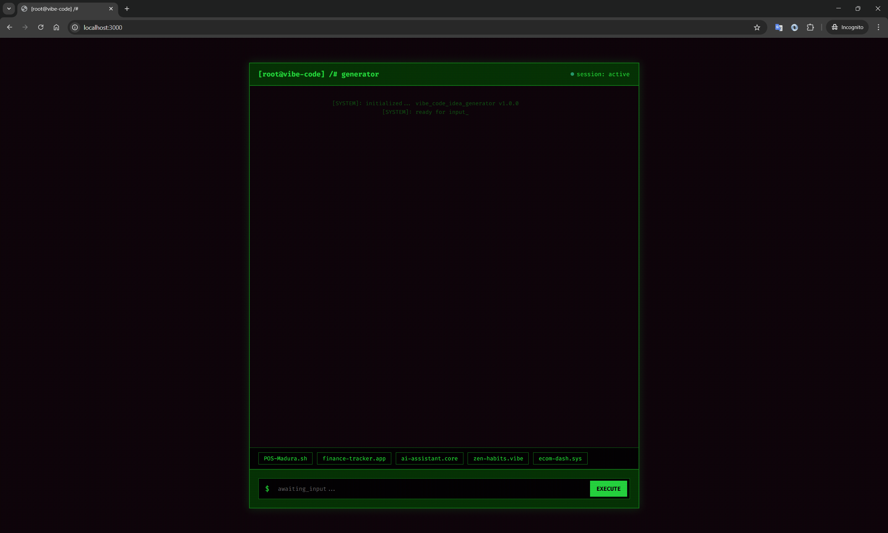

# [root@vibe-code] /# generator 🚀

[](https://nodejs.org/)

**Vibe Code Idea Generator** is a geeky, terminal-themed AI chatbot designed specifically for developers. Powered by **Google Gemini 2.5 Flash**, it doesn't just give you app ideas—it crafts detailed, technical prompts ready to be used with your favorite AI coding assistants (like Cursor, Windsurf, or Copilot).

---

## 🖥️ UI Preview


*Geeky terminal-inspired interface with neon accents and Fira Code typography.*

---

## ✨ Key Features

-   **🧠 Specialized Brain**: Specifically tuned to generate app ideas. No cooking recipes, no history lessons—just pure developer vibes.
-   **🛠️ Technical Prompt Generator**: Every idea comes with a massive, detailed prompt for "Vibe Coding" (coding via AI prompting).
-   **📟 Terminal Aesthetic**: A dark, monospaced interface that feels like home for any terminal user.
-   **⚡ Gemini 2.5 Flash**: Hyper-fast responses using the latest Google AI models.
-   **🎯 Strict Dev Focus**: If you ask it about "Nasi Goreng", it will politely (but firmly) tell you to get back to building apps.

---

## 🚀 Getting Started

### Prerequisites

-   Node.js (v20 or higher)
-   Google Gemini API Key (get it at [Google AI Studio](https://aistudio.google.com/))

### Installation

1.  **Clone the repository:**
    ```bash
    git clone https://github.com/SigitNurhanafi/vibe-code-idea-generator.git
    cd vibe-code-idea-generator
    ```

2.  **Install dependencies:**
    ```bash
    npm install
    ```

3.  **Setup Environment Variables:**
    Create a `.env` file in the root directory:
    ```env
    GEMINI_API_KEY=your_actual_api_key_here
    ```

### Running the App

Start the server using `nodemon` (for development) or `node`:

```bash
npm run dev
# or
node index.js
```

The app will be available at `http://localhost:3000`.

---

## 🛠️ Tech Stack

-   **Backend**: [Node.js](https://nodejs.org/) + [Express](https://expressjs.com/)
-   **AI SDK**: [@google/generative-ai](https://www.npmjs.com/package/@google/generative-ai)
-   **Frontend**: Vanilla JavaScript + CSS (Custom Terminal Design)
-   **Markdown Support**: [Marked.js](https://marked.js.org/)
-   **Icons/Vibe**: Fira Code Font & Retro Terminal Styles

---


> **TIP :**
> Try clicking the suggestion buttons like `POS-Madura.sh` to see how the bot generates a full technical specification for you!

**Happy Vibe Coding!** 💻✨
